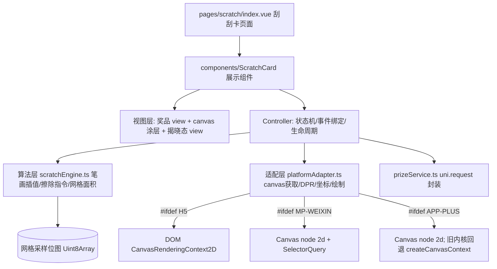
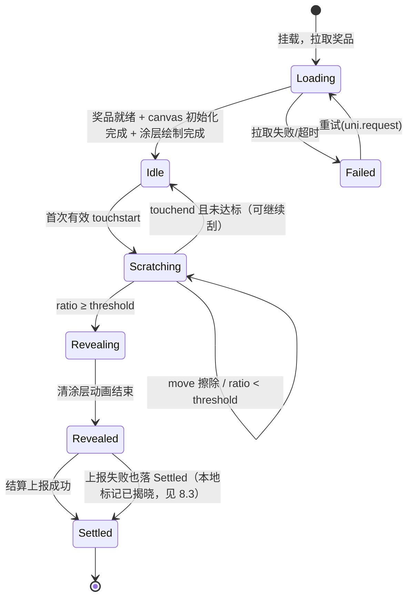

# 刮刮卡技术方案（H5 / App-vue / 微信小程序 三端同构）

> 适用项目：uni-app Vue3 + TypeScript + Vite 空白模板。
> 本文只做设计，不包含可运行实现；代码片段严格限制为 `interface/type` 与签名级片段（每处 ≤ 5 行）。

## 0. 硬性约束回应索引

| 约束 | 回应位置 | 结论 |
| --- | --- | --- |
| 2.1 三端同构（H5 / App-vue 非 nvue / 微信小程序） | §1、§3、§5 | 一套 SFC + 算法层；仅适配层按条件编译分叉；`pages.json` 新增页面（§7） |
| 2.2 零第三方依赖 | 全文 | 仅使用 uni API、Canvas 2D / Web API、vue3，无新增 npm 包 |
| 2.3 禁止实现代码 | 全文 | 只有 TS 接口、签名级片段（≤5 行）、伪代码 |
| 2.4 采样→擦除→面积判定→阈值全揭开 | §4 | 笔画插值 + destination-out 擦除 + 下采样网格 + alpha 双阈值 + 脏格增量 |
| 2.5 DPR / rpx→px / 物理逻辑像素对齐 / 事件坐标换算 | §5 | SelectorQuery 实测布局尺寸 + Canvas 节点宽高乘 DPR + ctx.scale + 坐标基于 boundingClientRect |
| 2.6 奖品文案层跨端实现（canvas 层级问题） | §6 | 首选 Canvas 2D 同层渲染：奖品层为 canvas 下方普通 view；App 旧 webview 回退：结果画进同一块 canvas，揭晓后再换 view |
| 2.7 性能预算 + 降采样/节流 + 禁止 touchmove 同步 getImageData | §8 | 单帧预算 ≤ 8ms；面积检测走 rAF/定时器节流 + 独立小画布下采样，与 touchmove 解耦 |

## 1. 总体架构

### 1.1 架构图



### 1.2 目录规划（后续编码按此落地）

```text
src/pages/scratch/index.vue                  # 刮刮卡页面（数据获取、结算上报）
src/components/scratch-card/index.vue        # ScratchCard 组件（模板/事件/状态机编排）
src/components/scratch-card/types.ts         # 全部 interface/type
src/components/scratch-card/scratchEngine.ts # 纯算法：插值、擦除路径、网格面积
src/components/scratch-card/platformAdapter.ts # 跨端适配：canvas 获取、DPR、坐标、绘制原语
src/components/scratch-card/useScratchCard.ts  # 组合式编排（算法层可独立单测）
```

纯算法层 scratchEngine.ts 不依赖任何 uni / DOM 对象，入参全是普通数据结构，可在 Node 下单测。

## 2. 核心模块划分与职责

| 模块 | 职责 | 不负责 |
| --- | --- | --- |
| `pages/scratch/index.vue` | 页面生命周期、拉取奖品数据、把奖品传给组件、监听 `complete` 做结算/上报、异常态 UI | 不直接操作 canvas |
| `ScratchCard/index.vue` | 模板结构（奖品 view 在下、canvas 在上）、`touchstart/move/end` 与 `mousedown/move/up` 绑定、调用适配层初始化、驱动状态机、达标后执行全揭开动画 | 不含面积数学、不直接写平台分支 |
| canvas 渲染层（适配层内） | 获取 canvas 节点/上下文、设置物理像素尺寸、填充涂层（纯色或 `drawImage` 贴图）、按指令执行线段擦除、全揭开（清空或淡出）、读取像素 | 不决定何时判定、不认识奖品 |
| 刮开算法层 `scratchEngine.ts` | 笔画点降采样与线段插值（补点防断线）、输出擦除指令、维护 N×M 网格位图、根据采样像素更新脏格、计算刮开率 | 不接触事件对象、不接触 canvas |
| 跨端适配层 `platformAdapter.ts` | 条件编译三套实现：canvas 获取（H5 直接 query DOM；MP/App 用 `uni.createSelectorQuery().select("#id").fields({node:true,size:true})`）、DPR（`uni.getSystemInfoSync().pixelRatio`）、坐标换算（`boundingClientRect`）、绘制原语（`globalCompositeOperation="destination-out"`、`arc/lineTo`）、像素读取（`ctx.getImageData` 或小离屏 canvas 中转） | 不含业务 |
| `prizeService.ts` | `uni.request` 拉奖品、超时/失败重试与降级默认奖品、结算上报 | 不渲染 |

模块间数据流（单向）：

```text
touch 事件 → 组件取 changedTouches[0] → 适配层转 canvas 逻辑坐标
→ 算法层 feedPoint() 产出「插值后线段点序列」→ 适配层按点序列执行 destination-out 擦除
→ 调度器在 rAF 中调算法层 needsCheck → 适配层采样像素 → 算法层 updateGrid/刮开率
→ 达到阈值 → 状态机迁移 → 组件全揭开 + emit complete
```

## 3. Canvas 方案选型决策矩阵

评分：✅ 良好 / ⚠️ 有条件可用 / ❌ 不可用或高风险。

| 维度 \ 候选 | A. 旧 `uni.createCanvasContext` | B. `<canvas type="2d">` 节点 + `getContext("2d")` | C. `cover-view` 模拟擦除 | D. H5 用 DOM+CSS mask，小程序另写一套 |
| --- | --- | --- | --- | --- |
| H5 支持 | ✅ uni H5 提供该 API（内部转真实 canvas） | ✅ H5 编译为真实 `<canvas>`，标准 2D ctx | ⚠️ H5 的 cover-view 被编译为普通 div，语义不一致 | ✅ 但仅 H5 |
| 微信小程序支持 | ⚠️ 可用但官方标注「停止维护」 | ✅ 官方推荐，同层渲染组件 | ✅ 但只能做色块/文字，无法做像素擦除 | ❌ 小程序无 DOM/CSS mask |
| App-vue 支持 | ✅ 5+ App webview 长期支持 | ⚠️ 取决于 App 内核：较新 XHTML5+ 内核支持 type=2d；旧内核仅旧 API | ⚠️ cover-view 在 App 上仅覆盖原生组件等有限场景 | ❌ 非 nvue App 无 DOM 暴露给业务 |
| 性能（中低端机） | ⚠️ 旧 API 走 JSCore↦原生序列化桥，指令批量 `draw` 才有性能，且频繁 `draw` 卡顿；无同层 | ✅ 2D 接口在小程序同层、直接操作 GPU 合成；H5 原生 | ❌ view 移动/重排触发布局，多点滑动会卡 | ⚠️ 两套实现性能不可比，维护翻倍 |
| API 可用性（像素读取） | ⚠️ `canvasGetImageData`（`canvas 2D` 之外的旧异步 wx API）存在但回调式、文档已弱化；`drawImage` 截屏能力受限 | ✅ 标准 `ctx.getImageData(x,y,w,h)` 同步可读、可建 `OffscreenCanvas`（小程序支持 `wx.createOffscreenCanvas` type 2d） | ❌ 无法读取像素，面积判定只能靠轨迹数学估算（误差大） | ✅ H5 可读，小程序侧无解 |
| 维护状态 | ❌ 微信官方文档明确：旧 Canvas 2D 接口（CanvasContext）自基础库 2.x 起「不再维护」，推荐新版 Canvas 2D | ✅ 现行主推 | ⚠️ cover-view 能力长期冻结（仅能嵌套 cover-view/cover-image/button） | ❌ 双实现长期维护成本最高 |
| 实现复杂度（三端一套） | 中（一套但处处踩坑、像素判定弱） | 低-中（一套标准 Web Canvas 心智模型，仅获取节点方式分叉） | 高（伪擦除效果要做轨迹遮罩，效果假） | 高（双轨） |
| 与奖品层叠加（层级） | ❌ 旧 canvas 原生组件层级最高，普通 view 盖不住，需要 cover-view | ✅ 小程序 Canvas 2D 为同层渲染，普通 view 可正常层叠（z-index 生效） | ⚠️ 只能用 cover-view 放文案，样式受限 | ❌ 两端层级模型不同 |

**最终选型：B —— `<canvas type="2d">` + 节点式 `getContext("2d")`，一套代码，适配层只在「如何拿到 canvas 节点」处分叉。**

理由：

1. 只有 B 同时满足三端同构 + 同步像素读取（`getImageData`）+ 标准合成模式（`destination-out` 擦除）+ 小程序同层渲染（彻底消除原生组件层级问题，直接解决约束 2.6）。
2. 旧 API（A）在微信侧已停止维护，且像素读取要走回调式旧接口、与频繁擦除的性能模型冲突（见 §8）。
3. App-vue 的兜底策略：运行时探测——`fields({node:true})` 能取回 `node` 即走 B；取不到（旧 App 内核）回退到 A 分支（同一适配接口下的内部实现），面积判定降级为「离屏 2d 采样 + 轨迹网格双保险」。即：**主路径 B，App 旧内核降级 A，组件与算法层零改动。**
4. C/D 均无法同时满足像素级判定与三端一致，淘汰。

> 依据文档：微信《canvas 2D》官方组件文档（新版 Canvas 2D 接口）开篇即说明旧版 CanvasContext 已停止维护；uni-app 组件文档《canvas》一节说明 type="2d" 时需通过 SelectorQuery 的 node 字段获取节点，并给出 `uni.createCanvasContext` 为旧接口的说明；微信《同层渲染》文档说明 canvas 2D 支持同层渲染。链接见 02 文档引用表。

## 4. 关键 TS 接口定义

### 4.1 组件 Props / Emits（types.ts）

```ts
export interface PrizeInfo { id: string | number; title: string; subTitle?: string; icon?: string }

export interface ScratchCardProps {
  prize: PrizeInfo | null              // 奖品数据；null 时显示 loading 涂层，禁止刮动
  widthRpx?: number                    // 默认 750
  heightRpx?: number                   // 默认 400
  brushRadiusRpx?: number              // 擦除笔刷半径，默认 28
  threshold?: number                   // 自动揭晓阈值 0~1，默认 0.5
  coverColor?: string                  // 涂层纯色，默认 "#B5B5B5"
  coverImage?: string                  // 可选涂层贴图（临时路径/网络路径，需先 uni.getImageInfo）
  gridCols?: number                    // 采样网格列数，默认 25
  gridRows?: number                    // 采样网格行数，默认 14（保持格宽≈2%）
  disabled?: boolean                   // 网络失败/已结算后置灰
}

export interface ScratchCardEmits {
  (e: "progress", ratio: number): void        // 刮开率变化（节流后，调试/埋点用）
  (e: "complete", prize: PrizeInfo): void     // 达标自动揭晓
  (e: "scratch-start"): void
}
```

### 4.2 几何与算法层接口

```ts
export interface Point { x: number; y: number }                 // 统一为 canvas 逻辑像素坐标（CSS px）

export interface StrokeSegment { from: Point; to: Point }       // 插值后相邻两点，间距 ≤ 步长

export interface EraseCommand { segments: StrokeSegment[]; radius: number } // 一帧内要擦的线

export interface SampleRect { x: number; y: number; w: number; h: number }  // 采样区域（逻辑 px）

export interface GridSnapshot { cols: number; rows: number;
  cells: Uint8Array; ratio: number }                          // 1=已擦净

export interface ScratchEngine {
  feedPoint(p: Point): EraseCommand | null                    // 签名；内部做插值补点
  beginStroke(p: Point): void
  endStroke(): void
  applySamples(samples: Uint8ClampedArray, rect: SampleRect): GridSnapshot // 用 alpha 更新脏格
  readonly ratio: number
}
```

### 4.3 适配层接口

```ts
export interface CanvasSurface {
  readonly logicalWidth: number; readonly logicalHeight: number  // CSS px
  paintCover(color: string, image?: string): Promise<void>
  erase(cmd: EraseCommand): void                                  // destination-out 画线
  sampleGrid(cols: number, rows: number): Uint8ClampedArray       // 经离屏小画布缩放后读 alpha
  revealAll(durationMs?: number): Promise<void>                   // 清涂层/淡出
  dispose(): void
}

export interface PlatformAdapter {
  mount(canvasId: string, opts: MountOpts): Promise<CanvasSurface>
  toCanvasPoint(e: TouchEventLike, rect: DomRectLike): Point      // 见 §5.3
}

export interface TouchEventLike { clientX: number; clientY: number } // 由组件从 touches/changedTouches 归一
export interface DomRectLike { left: number; top: number; scrollLeft?: number; scrollTop?: number }
export interface MountOpts { cssWidthPx: number; cssHeightPx: number; brushRadiusPx: number }
```

说明：

- H5 下 `mount` 用 `document.querySelector` 取节点（uni H5 允许用 Web API）；MP/App 用 `uni.createSelectorQuery().in(组件实例)`。
- `TouchEventLike` 由组件归一：`e.touches[0] || e.changedTouches[0]`；鼠标端从 `mousedown/mousemove` 的 `clientX/clientY` 构造。
- 不出现 `wx.*` 专有 API 出现在公共类型中；`wx.createOffscreenCanvas` 仅出现在 mp-weixin 条件编译实现内部。

## 5. 坐标系与 DPR 对齐（约束 2.5）

### 5.1 尺寸实测，不靠 rpx 手算

`transformPx: false` 意味着样式里写 `px` 不会被编译转换（见 02 文档风险 R4），所以：

- 模板上 canvas 与奖品层尺寸一律用 **rpx**（如 750rpx×400rpx），rpx 在三端都由框架按屏宽 750 基准换算，不受 `transformPx` 影响。
- JS 中**绝不自行 `rpx → px` 换算**（自算在平板、折叠屏、小程序 `screenWidth` 取整上会偏 1~2px）。统一在 `onReady`/`onMounted` 后用 SelectorQuery 实测：

```ts
uni.createSelectorQuery().in(instance)
  .select("#scratchCanvas").fields({ node: true, size: true, rect: true } as const).exec(cb) // 签名级
```

`size` 返回的 `width/height` 即布局 CSS px（逻辑像素），作为一切绘制坐标的基准。

### 5.2 物理像素对齐（防模糊、防坐标错位）

三端统一做法（标准 Canvas 2D）：

1. `dpr = uni.getSystemInfoSync().pixelRatio`（H5 可再与 `window.devicePixelRatio` 取较小值，上限钳制为 3，防止 4K 安卓屏显存/带宽爆炸）。
2. canvas **节点** `canvas.width = round(cssWidth * dpr)`、`canvas.height = round(cssHeight * dpr)`；canvas **样式**宽高保持 rpx（即 cssWidth/cssHeight）。
3. `ctx.scale(dpr, dpr)`，之后所有绘制/擦除都用逻辑像素坐标，不要再乘 dpr。
4. `ctx.lineCap = "round"`、`ctx.lineJoin = "round"`，保证擦除笔迹连续无圆斑间隙。
5. MP-Weixin 下节点宽高必须在 `fields({node:true})` 回调里设置；H5 在 mount 时设置；App 2d 分支同 MP。

旧 API 回退分支（App 老内核）：旧接口没有独立节点宽高概念，使用 `canvas` 组件 style 的 rpx 尺寸 + `<canvas>` 属性 `:style`，并接受其逻辑坐标系就是 CSS px；不再 `ctx.scale`，`pixelRatio` 仅用于采样区域换算（旧接口截图本身按物理像素，`canvasGetImageData` 传入的是 canvas 逻辑坐标、返回数据按物理像素——回退实现中需用 `res.width` 自适应，不假设等比）。

### 5.3 触摸点 → canvas 内部坐标

公式（逻辑像素）：

```text
x = touch.clientX - rect.left
y = touch.clientY - rect.top
```

要点：

- **不要用 `pageX - offsetLeft` 手减滚动**：小程序 touch 对象字段与 H5 不同，且 App webview 无 offsetLeft。统一用 SelectorQuery 拿到的 `rect.left/top`（视口坐标）配 `clientX/clientY`（也是视口坐标），**页面滚动天然抵消**，无需加 scrollTop。
- 每次 `touchstart` 重新查询一次 rect 并缓存（`touchmove` 期间不重复查询，零异步开销）；`onShow`、屏幕旋转(`onResize`)、监听 `uni.onWindowResize` 后使缓存失效并重设 canvas 尺寸。
- H5 鼠标事件同样有 `clientX/clientY`，公式一致；`mouseleave` 等价 touchend。
- 安全裁剪：换算后点钳制到 `[0, cssWidth] / [0, cssHeight]`，超出范围的点不进算法层，避免边缘圆弧画出界导致面积统计偏差。
- 组件内若祖先存在 `transform`（H5 常见动画容器），`getBoundingClientRect` 仍正确，但小程序 rect 不受 CSS transform 影响的实现差异需在风险清单验证（R6）；约定卡片祖先不使用 transform 位移作为规避。

## 6. 刮开链路与面积判定算法（约束 2.4）

### 6.1 全链路总览

```text
[1 笔画采样] touchstart→beginStroke；touchmove 每点 toCanvasPoint → feedPoint
[2 线段插值] 相邻点距离 > step(=笔刷半径的 60%) 时沿直线补点，保证快速甩动不断线
[3 涂层擦除] ctx.globalCompositeOperation="destination-out"；
             对每条 segment 画「粗线段」(lineWidth=2r, round cap)；每段两端补 arc 圆点
[4 面积采样] 不由 touchmove 触发；rAF 循环中按节流间隔(≥120ms)且本帧有擦除时：
             把整块 canvas 以降采样倍率绘制到 cols×rows 的小离屏画布
             （drawImage 缩放到 W=cols, H=rows），一次性 getImageData 取 alpha
[5 网格判定] 每个采样像素对应一个网格 cell；双阈值更新 cell 状态；统计 clean 数/总格数
[6 阈值触发] ratio ≥ threshold(默认 0.5) → 状态机迁移 Revealing → revealAll() 清空涂层
             → emit("complete", prize)
```

为什么用「`drawImage` 缩放到极小离屏画布再读一次」而不是对全尺寸 `getImageData`：
750rpx×400rpx 在 3x 机型物理像素约 1125×600≈67.5 万像素、270 万字节；中低端机一次
`getImageData` + JS 遍历 alpha 需要 8~20ms 且阻塞渲染。缩到 25×14=350 个采样点后，
读取与遍历成本 < 0.5ms，且降采样由原生/GPU 完成，还天然带区域平均（抗锯齿友好，见 6.4）。

### 6.2 网格划分

- 逻辑尺寸 `W×H`（CSS px，实测）。网格 `cols=25, rows=14`，cell 宽 `cw=W/cols`、高 `ch=H/rows`，单格面积占比 = 1/(25×14) ≈ 0.286%。
- 网格状态用 `Uint8Array(cols*rows)`：`0=有涂层 1=已擦净 2=边界/可疑`（三态，见 6.4）。
- 采样点取每格**中心**：`(col+0.5)*cw, (row+0.5)*ch`，避免落在笔画边缘的概率偏差；离屏缩放法等价于取格内 alpha 平均值，效果更稳。主用缩放法，中心点法作为旧 API 回退。

### 6.3 伪代码（算法层，签名/伪码，非可运行实现）

```text
fun beginStroke(p): last = p; active = true

fun feedPoint(p) -> EraseCommand?:
    if !active or p 出界: return null
    segs = []
    d = distance(last, p)
    step = max(1, brushRadius * 0.6)          # 补点步长，单位逻辑 px
    n = ceil(d / step)
    prev = last
    for i in 1..n:
        q = lerp(last, p, i / n)             # 快速甩动补点
        segs.push({from: prev, to: q}); prev = q
    if n == 0: segs.push({from: last, to: p}) # 单点/原地抖动：画圆点
    last = p
    return {segments: segs, radius: brushRadius}

fun endStroke(): active = false

# samples：离屏小画布读出的数组，长度 = cols*rows（RGBA 时步长 4 取 a）
fun applySamples(samples, cols, rows):
    for idx in 0..cols*rows-1:
        a = samples[idx*4 + 3]               # 0..255
        if a <= ALPHA_CLEAN(=24):    cells[idx] = 1      # 明确擦净
        else if a >= ALPHA_SOLID(=120): cells[idx] = 0  # 明确有涂层
        else: cells[idx] = 2                         # 抗锯齿半透明过渡带：可疑
    clean = count(cells == 1)
    fuzzy = count(cells == 2)
    # 可疑格按 50% 折算，避免边缘抖动导致 ratio 跳变越过阈值
    ratio = (clean + fuzzy * 0.5) / (cols * rows)
    return snapshot

调度（组件内，非算法层）：
onFrame():
    if dirty and now - lastCheckAt >= 120ms:
        samples = surface.sampleGrid(cols, rows)   # 离屏缩放读取
        snap = engine.applySamples(...)
        emit progress(snap.ratio)（再做 ≤10fps 的二次节流）
        if snap.ratio >= threshold and state == Scratching: goto Revealing
    rafId = requestAnimationFrame(onFrame)
```

### 6.4 抗锯齿 / 半透明像素误判处理（约束 2.4 重点）

误判根因：`destination-out` + round 线帽在笔迹边缘产生 alpha 渐变像素；涂层贴图本身可能带半透明；不同机型 GPU 合成的边缘 alpha 不同。若用「alpha<255 即算刮开」，一条细划痕就能虚高占比。

处理策略（多层叠加）：

1. **双阈值迟滞（hysteresis）**：`ALPHA_CLEAN=24`、`ALPHA_SOLID=120`。只有几乎完全透明才算净；几乎完全不透明才算未刮；中间带标记「可疑」按 0.5 折算，且**不单独触发揭晓**——揭晓额外要求 `clean/总格数 ≥ threshold - 0.05`，不能全靠可疑格凑阈值。
2. **区域平均替代单点**：离屏 `drawImage` 缩小让一格 = 原区域平均 alpha，边缘锯齿被摊薄，从统计上消除单点落边误差。
3. **迟滞防回跳**：cell 一旦为 `1` 不允许降回（单调性，只允许 `0→2→1`），ratio 单调不减，杜绝阈值附近反复触发。
4. **涂层底保证不透明**：纯色用不透明色；贴图模式先垫不透明底色再 `drawImage`，避免源图半透明造成「未刮却被判净」。
5. **边界像素（卡片四边）**：四边 cell 阈值与内部相同，但擦除绘制对坐标统一 clamp，笔迹不会在界外生成半透明像素再被采样；验收单列「四边各划一条直线」用例（见 03 文档）。
6. **判定触发时机**：仅在 `dirty && 节流间隔到达 && 状态==Scratching` 时判定；`touchend` 后强制再判一次（处理最后一笔）；揭晓后立即停 rAF 并切状态，避免重复触发。

### 6.5 全揭开动作

- 主路径：`ctx.clearRect` 整幅清空，配合 canvas 200~260ms CSS `opacity 1→0` 过渡（H5/MP 同层 canvas 支持 CSS opacity；App 以 clearRect 即时清除为准）。
- 揭开后保留 canvas 节点但禁用事件（`pointer-events:none` / 逻辑 `disabled`），奖品 view 露出并播放弹层动画。
- 不销毁重建 canvas（小程序重建会闪白屏）。

## 7. 奖品文案层的跨端实现（约束 2.6）

### 7.1 层级问题的本质

- 小程序与 App 中的**旧版 canvas 是原生组件**，由客户端原生渲染，层级永远高于 webview 内的普通 `view`，且不遵循 z-index；普通 view 无法覆盖在它上面（想覆盖只能用同为原生的 `cover-view`，而 `cover-view` 只能嵌套 `cover-view / cover-image / button`，无法放图文混排、无法用 flex 之外的大部分样式、不支持背景渐变/阴影）。
- 但**新版 `<canvas type="2d">` 在微信小程序已同层渲染**（官方《同层渲染》文档列出的同层组件包含 canvas 2D），它由 webview 合成，普通 view 可正常压在其上下，z-index/opacity 均生效。H5 的 canvas 本来就是真 DOM，天然同层。

### 7.2 采用方案（经三端推演可行）

```text
<view class="card" style="position:relative; width:750rpx; height:400rpx">
    <!-- 下层：奖品结果，普通 view，任意图文样式 -->
    <view class="prize-layer">…prize.title / icon（image）…</view>
    <!-- 上层：涂层 canvas；未刮前不透明盖住奖品，刮开处透明露出下层 -->
    <canvas type="2d" id="scratchCanvas" class="cover-canvas"
            @touchstart @touchmove.stop.prevent @touchend
            @mousedown @mousemove @mouseup />
    <!-- 揭晓后弹层（可选）：同为普通 view，同层后可正常覆盖 -->
</view>
```

> 上为**结构示意（非完整 SFC）**：仅表达层叠关系与事件绑定面，不含样式值与脚本逻辑；实现轮按此结构补全 class 样式与 handler 接线。

关键点：**奖品层不在 canvas 之上，而在 canvas 之下**。刮刮卡的视觉模型本就是「透过被刮掉的透明区看下面的内容」，因此下层 view + 上层透明化 canvas 在三端都成立：

- 微信小程序：canvas 2D 同层渲染，普通 view 与其可以任意层叠，下层 view 透过透明像素可见，无需 cover-view。
- H5：canvas 是普通 DOM，`position:absolute; inset:0` 与下层 view 层叠无任何特殊点。
- App-vue：使用支持 type=2d 的新 XHTML5+ 内核时行为对齐小程序；旧内核（回退旧 API、canvas 为原生组件）下，下层 view **被原生 canvas 整体遮挡**，因此回退策略改为：未刮阶段涂层与「刮刮乐提示文案」都绘制在 canvas 内；达到阈值全揭开时 `clearRect` 并**立即把 canvas 隐藏（display:none / 条件渲染）**，此时原生组件移除，下方普通 view 露出。刮动过程中看不到奖品是可接受的（真实刮刮卡刮动中也只能看到已刮区域），而旧内核下「刮动中透过透明区实时看下层 view」不可靠，故回退分支在透明区绘制阶段用 canvas 内部绘制一份纯色底 + 提示，揭晓瞬间切换。

### 7.3 为什么不选其他方案

- **cover-view 盖在旧 canvas 上放奖品**：无法放复杂图文（限制见上），且 cover-view 在 H5 退化为普通 div、在 App 支持面窄，三端样式不可能统一；否决。
- **把奖品文字用 `fillText` 画进 canvas**：三端字体回退、行高、emoji/图标、多行排版差异大，且无法点击奖品按钮；只作为旧内核回退的过渡手段，不做主方案。
- **两张 canvas 叠放**：原生组件互相叠加的层级在旧内核同样不可控，且多一块 GPU 表面，否决。

### 7.4 模板注意事项（编码时遵守）

- canvas 必须显式宽高样式（rpx），`position:absolute; left:0; top:0`，与下层奖品层同尺寸对齐。
- `@touchmove.stop.prevent` 阻止页面滚动（H5 用 `.prevent`；小程序对 catchtouchmove 等价，uni 写法为 `@touchmove.stop` 即可阻止冒泡，是否 preventDefault 由平台忽略不报错）。
- canvas 同层后仍不要在其上方放需要响应触摸的元素（刮动中触摸必须落给 canvas）；揭晓弹层在 `Revealed` 后才挂载。

## 8. 状态机

### 8.1 状态定义与迁移



### 8.2 各状态进入/退出动作（行为契约）

- `Loading`：canvas 已可挂载但禁止输入（`disabled`）；涂层可先画灰底 + 「加载中」由下方 view 承担（canvas 不绘制文字）；超时 5s 进 `Failed`。
- `Idle`：仅绑定事件、开 rAF 循环但 `dirty=false`；不做像素采样。
- `Scratching`：处理擦除；按 §8.4 节流采样；页面 `onHide` 时进入暂停处理（见异常转移）。
- `Revealing`：停止接受输入；`clearRect` + opacity 过渡；过渡结束（H5 `transitionend` 不可靠时统一用 `setTimeout(260)`）进 `Revealed`。
- `Revealed`：emit `complete`；页面做结算/上报；按钮（「查看奖品」）可用。
- `Settled`：组件锁定，重复进入页面直接展示已揭晓结果（幂等由页面按 prizeId 缓存）。

### 8.3 异常转移

- **中途切后台（`onHide` / App 进入后台）**：
  - 组件监听页面 `onHide`（页面内通过 `@vue/runtime-core` 的 `onHide` 生命周期，uni-app vue3 在页面里使用 `onHide` 从 `@dcloudio/uni-app` 导入）：置 `paused=true`、停止 rAF、结束当前 stroke（`endStroke`，防止回前台后两点连成一条超长擦除线）、保存当前 `cells/ratio`（在内存；不做持久化）。
  - `onShow`：重新 SelectorQuery（rect/尺寸可能变化）、按需重设 canvas 物理像素、**涂层与擦除结果不持久化则重绘整幅灰涂层并清零 ratio**（本方案采用「回前台重置为未刮」的简单语义，产品上等同重新发一张卡；若产品要求保留进度，则在 onHide 前用 `canvas.toDataURL()`（H5/MP 2D 支持 `wx.canvasToTempFilePath` 对应旧 API、2D 节点可用 `wx.canvasToTempFilePath({canvas:node})`）导出图片，onShow 后 `drawImage` 恢复——列为可选增强，不进入首版）。
- **奖品数据网络中断/失败**：
  - 拉取阶段失败 → `Failed`，显示重试按钮，**不允许刮无奖之卡**（避免先刮后告知无数据的客诉）。
  - 已刮达标、结算上报失败 → 不回滚视觉；本地生成待上报队列（`uni.setStorage` 存 prizeId+时间戳），`onShow`/网络恢复（`uni.onNetworkStatusChange`）时补报；状态仍进 `Settled`。
  - 奖品数据在刮前到达但字段异常（无 title）→ 按兜底奖品「谢谢参与」处理并埋点。
- **canvas 初始化失败**（SelectorQuery 取不到 node，且非旧内核）：`Failed` 并提示升级微信/App 版本；上报设备信息（`uni.getSystemInfoSync` 的 SDKVersion、platform）。
- **来电/系统弹窗导致 touch 序列中断**（收到 touchstart 无 touchend）：监听 `onHide` 兼作兜底；另在 `touchmove` 中检测时间戳 gap > 1s 则强制 `endStroke` + 重新 `beginStroke`。

## 9. 性能预算（约束 2.7）

目标机型：中低端 Android（如骁龙 6 系级别、微信基础库当前主流版本）；卡片 750rpx×400rpx，3x 屏物理像素约 1125×600。

### 9.1 单帧预算（16.7ms 帧内，touchmove 响应路径目标 ≤ 8ms）

| 环节 | 预算 | 手段 |
| --- | --- | --- |
| 事件归一 + 坐标换算（2 次减法 + clamp） | ≤ 0.2ms | 纯数值，rect 缓存 |
| 算法层 feedPoint（插值补点，一帧通常 ≤ 8 段） | ≤ 0.5ms | O(n) 纯计算，无对象分配（复用数组） |
| ctx 擦除绘制（8 段以内 lineTo + 一次路径提交） | ≤ 4ms | 合并在同一 beginPath 内提交，减少 JSCore↦原生往返（小程序） |
| 状态更新/置 dirty | ≤ 0.1ms | - |
| **touchmove 合计** | **≤ 5~8ms** | **不读像素** |
| 面积采样（独立 rAF，≥120ms 一次） | ≤ 2ms | drawImage 到 25×14 离屏画布 + 350 次 alpha 比较 |
| CSS 揭晓动画 | 合成层开销 | opacity/transform 走 GPU 合成 |

### 9.2 降采样与节流策略

1. **事件级降采样**：touchmove 两点距离 < 2px（逻辑）时丢弃该点（笔迹由 round cap 连续覆盖，视觉无损）。
2. **插值兜底**：距离过大不丢点而是按 `step=0.6r` 补点（见 §6.3），所以「降采样」只降密集点，不降快速甩动。
3. **每帧一次擦除提交**：同一事件回调内的多段合并到一个 `beginPath()…stroke()`，小程序端把多次桥调用压缩为一次。
4. **面积检测与触摸解耦**：单一 `requestAnimationFrame` 循环（App 旧内核/H5 兜底用 `setTimeout(16)`，小程序 2D 环境 rAF 由 uni `canvas.requestAnimationFrame()` 提供——节点 2D 的 canvas 对象上有该方法，编码时通过 surface 暴露），仅当 `dirty && now-lastCheck≥120ms` 才采样；`progress` emit 再限频到 ≤10fps。
5. **达标后熔断**：进入 Revealing 立即停 rAF、解绑 move，零后续开销。
6. **DPR 上限 3**：高于 3 的屏按 3 处理，视觉差异不可察但像素量降 40%+。
7. **涂层贴图预解码**：`coverImage` 在 Loading 阶段经 `uni.getImageInfo` 预取为本地路径并创建 `image` 对象（H5 `new Image()`；MP 2D 用 `canvas.createImage()`），避免首笔时解码卡顿。

### 9.3 为什么不能在 touchmove 里同步 getImageData

1. **耗时直接吃掉帧预算**：全尺寸 67.5 万像素的 `getImageData` 在中低端 Android 微信内实测量级 5~15ms（GPU→CPU 回读是同步流水线冲刷，会强制 flush 尚未完成的绘制指令），叠加同帧擦除绘制必然掉帧、触摸跟手性变差。
2. **读回会打断 GPU 流水线**：`drawImage/stroke` 与回读在同一上下文必须串行化，touchmove 每帧回读使硬件加速退化为串行。
3. **触摸事件触发频率高于帧率**：部分安卓机 touchmove 可达 120~240Hz，每事件读像素毫无意义（涂层变化以帧为单位）。
4. **小程序线程模型放大代价**：逻辑层与渲染层分线程，2D 接口虽同上下文但回读仍是阻塞式原生调用，高频调用会拖慢 WebView 渲染线程，表现为整块画布卡顿。
5. 因此本方案把读像素放到独立调度器、间隔 ≥120ms、且先降采样到 350 像素：既保证「刮过半秒内揭晓」的体感（120ms 人眼几乎无感），又把回读成本压到 2ms 内。

## 10. 工程接入（编码轮次照做）

### 10.1 pages.json 新增页面

在 `src/pages.json` 的 `pages` 数组追加：

```json5
{ "path": "pages/scratch/index", "style": { "navigationBarTitleText": "刮奖" } }
```

### 10.2 manifest.json

- 保持 `transformPx: false` 不变；样式一律用 rpx，不在组件里写 px 尺寸（1px 边框等可接受，见 R4）。
- 不新增模块、不新增权限、不新增依赖。

### 10.3 条件编译边界

- 组件模板：一套（canvas 统一写 `<canvas type="2d">`；H5 编译目标同样接受该属性，uni H5 透传为标准 canvas）。
- `platformAdapter.ts` 内用 `// #ifdef H5 / MP-WEIXIN / APP-PLUS` 分三段实现 mount/sample；坐标换算函数三端共用。
- 页面生命周期 `onShow/onHide` 从 `@dcloudio/uni-app` 导入（uni-app vue3 官方用法）。

### 10.4 落地顺序建议

1. types.ts → 2. scratchEngine.ts（Node 单测插值/网格/阈值）→ 3. platformAdapter（先 H5 调通视觉与坐标）→ 4. 组件+状态机 → 5. MP 真机 → 6. App 真机与旧内核回退 → 7. 按 03 文档矩阵验收。

## 11. 自评表（对应评分维度）

| 评分维度 | 自评 | 说明 / 待人工复核点 |
| --- | --- | --- |
| 4.1 API 真实性 | 待真机回归确认 | 使用的 API 均为官方文档在录 API：`uni.createSelectorQuery`、`fields({node,size,rect})`、`canvas.getContext("2d")`、`uni.getSystemInfoSync().pixelRatio`、`globalCompositeOperation`、`getImageData/drawImage`、`canvas.requestAnimationFrame`、`canvas.createImage`（MP 2D）、`uni.createCanvasContext`（仅回退）、`canvasGetImageData`（旧）、`wx.canvasToTempFilePath`（可选增强）、`uni.getImageInfo`、`uni.onNetworkStatusChange`、`uni.setStorage`、`onShow/onHide`（`@dcloudio/uni-app`）。无自造 API；实现轮需在三端真机各跑一遍最小调用验证版本差异 |
| 4.2 约束覆盖度 | 7/7 显式回应 | 见 §0 索引表；三端一套代码+适配分叉（2.1）、零依赖（2.2）、仅接口/签名/伪码（2.3）、全链路+抗锯齿（2.4/§6）、DPR 与坐标（2.5/§5）、文案层（2.6/§7）、性能预算（2.7/§9） |
| 4.3 决策质量 | 充分取舍 | §3 四候选 × 8 维度（超过要求的 4×6），结论为 Canvas 2D 主路径 + App 旧内核 createCanvasContext 回退，给出层级与像素读取两个决定性理由 |
| 4.4 风险深度（额外发现） | 见 02 文档 | 额外覆盖：touch 序列被系统中断、同层渲染灰度/基础库版本、canvas 圆角与外层 border-radius 合成差异、H5 高分屏 DPR 钳制、图片域名/downloadFile 白名单、iOS 橡皮筋滚动与点击态、App webview 内核碎片化、rAF 来源差异、toDataURL 安全限制、多点触控第一指追踪、半透明导航/安全区对 rect 的影响等 |

> 文档版本：v1.0（设计稿）。后续编码如发现真机行为与本方案不符，须回写 02 风险清单并更新此处结论。
