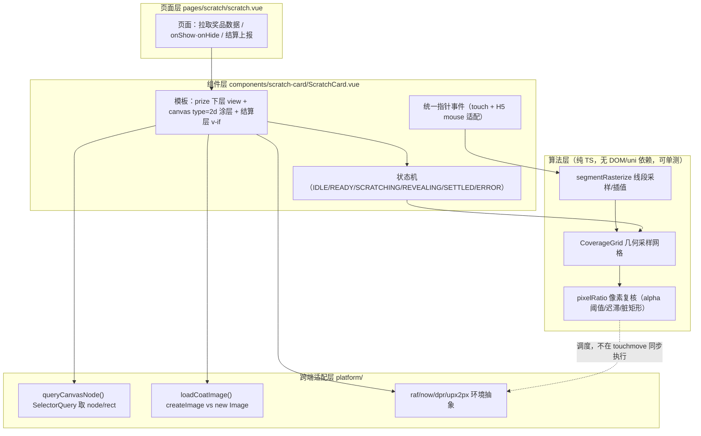
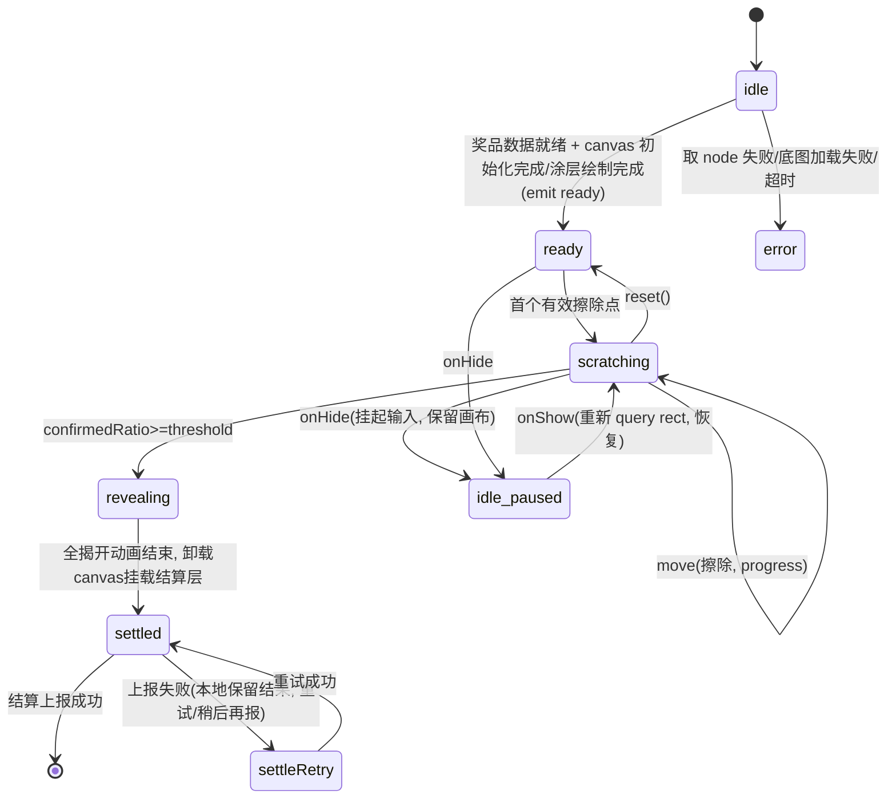

# 刮刮卡技术方案（H5 / App-vue / 微信小程序 三端同构）

> 适用项目：uni-app Vue3 + TypeScript + Vite（`@dcloudio/*` 版本 `3.0.0-5020420260813003`）
> 范围：仅技术设计，不含可运行实现代码。文中只出现 TS 接口/类型、≤5 行的 API 签名片段与标注为「伪代码」的算法描述。
> 硬性约束对应索引：2.1 见「§2 三端同构总览」、2.2 见「§12 依赖声明」、2.3 见「§11 代码形态约束」、2.4 见「§6/§7」、2.5 见「§8」、2.6 见「§5」、2.7 见「§9」。

---

## 1. 总体架构

### 1.1 分层结构



### 1.2 DOM/组件树（三端同一份模板）

```
<view class="sc-page">
  <view class="sc-card">                 // position:relative; 固定 750rpx×400rpx
    <view class="sc-prize-layer">        // position:absolute; inset:0; z-index:1
      奖品文案 / 奖品图（普通 view、image、text）
    </view>
    <canvas class="sc-coat" type="2d"    // position:absolute; inset:0; z-index:2
            id="scratchCoat" />          // 背景透明，不透明的是「画上去的涂层」
    <view v-if="settled" class="sc-result-layer"> // z-index:3，达标后才挂载
      中奖结果 + CTA 按钮（纯 view）
    </view>
  </view>
</view>
```

关键决策：**奖品文案永远放在 canvas 下层，而不是盖在 canvas 上**。canvas 涂层被 `destination-out` 擦除后变透明，下层 view 自然透出；达标后再卸载 canvas、挂载纯 view 的结算层。这样规避小程序原生组件层级问题（详见 §5）。

---

## 2. 三端同构总览（约束 2.1）

| 主题 | H5 | App（vue 页，非 nvue） | 微信小程序 |
|---|---|---|---|
| 渲染形态 | canvas 是真实 HTMLCanvasElement（DOM） | vue 页运行在系统 WebView 内，canvas 为 WebView 内的画布节点 | canvas 是小程序组件；`type="2d"` 走同层渲染 |
| 节点获取 | SelectorQuery 返回真实 DOM node | SelectorQuery 返回 WebView 画布 node | SelectorQuery `fields({node:true})` 返回 Canvas node |
| 坐标 | `clientX/Y - boundingClientRect` | 同 H5（WebView 内 clientX/Y） | 优先用 touch 事件自带 `x/y`，回退 clientX/Y-rect |
| 像素读取 | `ctx.getImageData` 同步标准 API | 同 H5（WebView 标准 API） | Canvas 2D 的 `ctx.getImageData` 同步 API；旧接口 `wx.canvasGetImageData` 为异步 |
| 下层 view 透出 | 天然成立 | WebView 内天然成立 | 依赖 type=2d 同层渲染的透明合成（旧版原生 canvas 不保证） |
| 页面注册 | `pages.json` 新增路径即可 | 同左 | 同左（本项目已在 manifest 配置 `transformPx:false`，无需改动 manifest） |

`src/pages.json` 需要新增页面（配置片段，非函数代码）：

```json
{ "path": "pages/scratch/scratch", "style": { "navigationBarTitleText": "刮刮卡" } }
```

App 端明确使用 **vue 页面**（文件位于 `pages/`，不建 nvue 文件），三端共用该 SFC，不写 nvue 分支。


---

## 3. 核心模块划分与职责

| 模块 | 文件（建议） | 职责 | 依赖方向 |
|---|---|---|---|
| 页面 | `src/pages/scratch/scratch.vue` | 奖品数据拉取/缓存、生命周期 `onShow/onHide`、中奖结算上报、错误兜底页 | 依赖组件 |
| 卡片组件 | `src/components/scratch-card/ScratchCard.vue` | 模板层级、props/emits、状态机、指针事件绑定、DPR 初始化与重绘编排 | 依赖适配层+算法层 |
| Canvas 渲染层 | `components/scratch-card/render.ts` | 涂层填充/底图绘制、`globalCompositeOperation='destination-out'` 笔迹擦除、全揭开/重置 | 依赖适配层返回的 ctx |
| 刮开算法层 | `components/scratch-card/math/`（`coverage.ts`、`raster.ts`、`types.ts`） | 线段插值采样、网格计数、像素复核、阈值判定；**纯函数**，不 import uni/DOM | 无外部依赖 |
| 跨端适配层 | `components/scratch-card/platform/`（`query.ts`、`image.ts`、`env.ts`） | SelectorQuery 取 node+rect、跨端 createImage、DPR/`uni.upx2px`/rAF/时间源 | 仅依赖 uni API |
| 配置 | `components/scratch-card/config.ts` | 阈值、笔刷直径(rpx)、网格粒度、节流间隔、迟滞双阈值 | — |

算法层保持纯 TS 的目的：可在 Node 单测里直接喂坐标序列验证覆盖率，不依赖任何端。

---

## 4. Canvas 方案选型决策矩阵（约束：体现真实取舍）

评分含义：◎=优/原生支持，○=可用但有代价，△=差/受限，✕=不满足。

| 候选方案 | 三端支持度 | 运行性能 | 关键 API 可用性 | 维护状态 | 实现复杂度 | 像素读取（面积判定） |
|---|---|---|---|---|---|---|
| **A. `canvas type="2d"`（SelectorQuery 取 node）** | ◎ H5 真 DOM；◎ 微信新 Canvas 2D 同层；○→◎ App-vue 新版 WebView 支持但 node 返回形态需真机 spike（见 R2，适配层内置降级） | ◎ 同一 CanvasRenderingContext2D，硬件加速好 | ◎ 标准 `getContext('2d')`/`getImageData`/`createImage` | ◎ 微信官方主推新接口 | ○ 需异步 query+node 初始化、DPR 手动对齐 | ◎ `ctx.getImageData` 同步读 alpha |
| B. `uni.createCanvasContext(旧版 2d)` | ○ H5/App 可用；微信基础库已标记废弃，同层与新特性受限 | ○ 指令批量提交、有桥接开销 | ○ 读像素需 `uni.canvasGetImageData` 异步回调 | ✕ 微信侧旧接口废弃（见风险 R1） | ○ API 简单 | △ 仅异步回调，无法在判定点即时拿结果 |
| C. `cover-view` 模拟（view 拼涂层+cover-view 盖结果） | △ 仅为解决小程序原生层级而存在；H5/App 多余 | ✕ 无法做真正的像素擦除与面积统计 | ✕ 无擦除/像素能力 | ○ | △ | ✕ 完全不具备 |
| D. DOM + CSS mask（`-webkit-mask`/`clip-path`） | △ 仅 H5 与 App WebView 可控；**微信小程序不支持任意 CSS mask 作用于该合成** | ○ H5 快 | ✕ 小程序无对应 Web API | ✕ | △ 需三端分叉 | △ 无法跨端统一读像素 |
| E. 纯 view 点阵（div/view 网格逐个透明） | ◎ 三端 view 通用 | △ 节点数随网格爆炸（18×34≈612 节点），小程序 setData/渲染压力大 | ○ | ○ | ○ | △ 只能网格估算、无真实抗锯齿边缘，颗粒感重 |

**最终选型：A（`canvas type="2d"`）。**

理由：
1. 只有 A 同时满足「三端同一套上下文 API + 可同步 `getImageData` 做面积复核 + 透明合成让下层 view 透出」，直接命中约束 2.1/2.4/2.6。
2. 微信已把旧 `wx.createCanvasContext` 路线标记为废弃（风险 R1），选 A 避免技术债。
3. C/D 都不能三端统一，E 用节点数换可判定性，在 750×400 卡片上中低端小程序会掉帧。A 的代价仅为「初始化必须异步 query node + 手动 DPR 对齐」，可被适配层收敛（§8）。
4. 文案不压在 canvas 上方，因此**不需要 cover-view**（§5），从根上绕开原生组件层级与 cover-view 子组件限制（风险 R3）。


---

## 5. 中奖结果文案层的跨端实现（约束 2.6）

### 5.1 为什么不能把文案用普通 view 盖在 canvas 上

- H5：canvas 是普通 DOM，view 覆盖天然可行。
- 微信小程序：canvas 历史上是**原生组件**，原生组件层级高于 WebView 渲染的普通 `view`，普通 view 会被 canvas 遮住；官方为此提供的 `cover-view` 只能覆盖在原生组件之上，且 `cover-view` 内**只能嵌套 `cover-view`/`cover-image`（及受限的 button）**，无法放任意奖品图文、富文本、动画组件。
- App-vue：页面跑在系统 WebView，2d canvas 在 WebView 合成体系内，但为了「三端同一套层级结构」不能依赖仅 H5 成立的覆盖关系。

结论：**「view 盖 canvas」+「cover-view 盖 canvas」都不能三端统一**（cover-view 的子组件限制详见风险 R3）。

### 5.2 可行方案：文案在下层，透明涂层在上层（本方案采用）

- 层级：`奖品 view（z1，普通组件，任意图文）` → `canvas type=2d 涂层（z2）` → `结算层 view（达标后挂载，z3）`。
- 原理：canvas 初始绘制一张**不透明涂层**；刮动时用 `globalCompositeOperation='destination-out'` 把笔画位置的涂层擦成**全透明**；canvas 的透明区域与其下方普通 view 由渲染器合成，奖品文案自然露出。`type="2d"` 在微信端走同层渲染，与普通 view 同层合成，透明透出成立（旧版非 2d 原生 canvas 不保证，故不选 B）。
- 达标后：先把 canvas 剩余涂层做一次「全揭开」（清空或淡出动画），随后 `v-if` 卸载 canvas、挂载纯 view 的 `sc-result-layer`（可放按钮、动效、领奖 CTA），此刻屏幕上**已无原生 canvas**，任何普通组件都不再受层级约束。
- 兜底：极少数旧微信版本若同层透明透出异常（验收矩阵 M-DPR-3 覆盖），降级为「达标即隐藏 canvas」——即在判定达标瞬间 `canvas` 设置 `hidden`，下层奖品 view 完整可见，功能与结果不受影响，仅损失刮的过程观感。

### 5.3 为什么该方案三端都成立

H5/App-vue 都在 Web 合成模型内，「上透明下不透明」是标准合成；微信 `type="2d"` 是同层渲染组件，文档明确其与 WebView 内普通节点同层、支持标准 2D 上下文与透明像素。三端共用同一份模板与同一套绘制指令，无平台分叉模板。

---

## 6. 关键 TS 接口定义（仅类型，无函数体）

### 6.1 组件 props / emits / 暴露方法

```ts
// components/scratch-card/types.ts
export type ScratchPhase =
  | 'idle'        // 未初始化（奖品数据未到）
  | 'ready'       // 涂层已绘制，待刮
  | 'scratching'  // 刮开中
  | 'revealing'   // 达标，全揭开动画中
  | 'settled'     // 结算完成
  | 'error'       // 初始化/数据异常

export interface PrizeData {
  prizeId: string
  title: string
  subtitle?: string
  imageUrl?: string
  won: boolean
}

export interface ScratchCardProps {
  prize: PrizeData | null
  widthRpx?: number          // 默认 750
  heightRpx?: number         // 默认 400
  threshold?: number         // 刮开占比阈值，默认 0.55（55%）
  brushRadiusRpx?: number    // 擦除笔刷半径，默认 22
  coat?: string | { imageUrl: string } // 纯色或底图
  enabled?: boolean          // 数据未就绪/已结算时禁用输入
}

export interface ScratchCardEmits {
  (e: 'ready'): void
  (e: 'progress', payload: { ratio: number }): void
  (e: 'complete', payload: { prize: PrizeData; ratio: number }): void
  (e: 'error', payload: { code: ScratchErrorCode; message: string }): void
}

export interface ScratchCardExpose {
  reset: (nextPrize?: PrizeData) => Promise<void>
  revealAll: () => void
  getRatio: () => number
}
```

### 6.2 算法层接口（纯函数）

```ts
export interface LogicalPoint { x: number; y: number } // canvas CSS 像素，左上角原点
export interface RasterConfig {
  cols: number; rows: number          // 逻辑采样网格，建议 36×20
  widthPx: number; heightPx: number   // canvas CSS 逻辑像素
  alphaClear: number                  // 透明判定阈值，建议 alpha < 25
  alphaSolid: number                  // 不透明迟滞阈值，建议 alpha > 230
}
export interface CoverageState {
  cleared: Uint8Array                 // 长度 cols*rows，1=已刮开格
  clearedCount: number
  ratio: number                       // clearedCount/(cols*rows)
  dirty: boolean
}
export interface Rasterizer {
  stroke: (from: LogicalPoint, to: LogicalPoint, radiusPx: number) => void
  snapshot: () => Readonly<CoverageState>
}
```

### 6.3 适配层接口与关键 API 签名（每处 ≤5 行）

```ts
// platform/query.ts
export interface CanvasNodeInfo {
  node: any; ctx: CanvasRenderingContext2D
  widthPx: number; heightPx: number; dpr: number
}
export const queryCanvasNode: (selector: string) => Promise<CanvasNodeInfo>
// 内部使用（签名，非实现；rect 由 boundingClientRect 提供，fields 无 rect 键）：
// uni.createSelectorQuery().in(scope).select(sel)
//   .fields({ node: true, size: true }).boundingClientRect().exec(cb)
```

```ts
// platform/image.ts
// 涂层为图片时跨端取 Image 构造器：
// MP-WX: const img = canvasNode.createImage()
// H5/App: new window.Image()
export const createCanvasImage: (node: any) => HTMLImageElement
export const loadCanvasImage: (img: HTMLImageElement, src: string) => Promise<void>
```

```ts
// platform/env.ts
export const getDpr: () => number                 // uni.getSystemInfoSync().pixelRatio
export const upx2px: (rpx: number) => number      // uni.upx2px(rpx)
export const now: () => number                    // Date.now / performance.now
export const raf: (cb: () => void) => number      // canvas.requestAnimationFrame 优先
export const cancelRaf: (id: number) => void
```


---

## 7. 刮开完整算法链路（约束 2.4）

链路：**笔画采样 → 涂层擦除 → 几何网格预估（高频）→ 像素复核（低频/异步）→ 达标全揭开**。
设计要点：高频路径只做整数网格运算（微秒级），昂贵的 `getImageData` 放到节流后的异步复核，二者互为校验。

### 7.1 笔画采样与插值（segmentRasterize）

- 输入：上一次点 `P0`、本次事件点 `P1`（均为 canvas 内部逻辑坐标，见 §8.3）。
- 快速甩动时两个 touchmove 点间距可能 > 笔刷直径，直接画两个圆点会断笔。沿线段按步长 `step = max(1, radiusPx*0.5)` 线性插值出若干采样点，保证笔迹连续。
- 每个采样点做两件事：① 送渲染层画一个擦除圆；② 送 CoverageGrid 标记其覆盖到的网格（几何预估）。
- 边界处理：采样点先做 `clamp` 到 `[0,width]×[0,height]`，圆与卡片矩形相交时只统计落在矩形内的格。

标注（伪代码，非实现）：

```text
onMove(P1):
  if disabled or phase not in (ready,scratching): return
  P1 = clamp(toCanvasLocal(P1), cardRect)
  if P0 absent: samples = [P1] else: samples = interpolate(P0, P1, step)
  for Q in samples:
      render.eraseCircle(Q, radiusPx)          // §7.2
      grid.markDisk(Q, radiusPx)               // §7.3 几何
  P0 = P1
  schedulePixelVerify()                        // §7.5，节流
```

### 7.2 涂层擦除（destination-out）

- 初始化：`ctx.fillStyle = coatColor`（或 `drawImage(coatImg)`）画满不透明涂层。
- 擦除：设置 `ctx.globalCompositeOperation = 'destination-out'`，用 `beginPath/arc/fill` 在每采样点画实心圆。`destination-out` 只降低目标 alpha，重复描边幂等，不会越擦越黑。
- 画完恢复 `ctx.globalCompositeOperation = 'source-over'`。
- 抗锯齿：圆边缘会生成「半透明过渡像素」，这正是 §7.4 必须处理的对象。

### 7.3 面积占比判定（双轨：网格预估 + 像素复核）

把卡片在**逻辑像素空间**划成 `cols×rows`（建议 36×20，约每格 20rpx）网格，用 `Uint8Array(cols*rows)` 记录该格是否「已刮开」。

- 几何预估（每次 move 同步、仅整数运算）：对擦除圆盘覆盖到的格置 1。`ratio = clearedCount / totalCells`。
- 该值是「上界估计」：圆盘扫过即算刮开，不考虑边缘抗锯齿，可能略偏大。
- 用它做**快速门控**：只有几何 `ratio` 达到「预警线」（如 `threshold - 0.08`）后，才允许调度像素复核，避免全程读像素。

### 7.4 抗锯齿 / 半透明像素误判处理（重点）

问题：擦除圆边缘、canvas 缩放都会产生 alpha 介于 0~255 的半透明像素；若用「alpha<128 即刮开」会把边缘也算进面积，造成系统性高估；且相邻笔画叠加会让同一像素在阈值附近抖动，导致 ratio 来回跳变。

策略（四条叠加）：

1. **只认 alpha 通道**，不看 RGB：`getImageData` 后取每像素第 4 字节。判定「已刮开」用严格透明阈值 `alphaClear=25`（约 <10% 不透明度），视觉上已近乎看穿，避免把半透明边缘算作刮开。
2. **迟滞双阈值（hysteresis）**：格状态翻转为「刮开」要求 `alpha < alphaClear(25)`；一旦置位不再因后续帧 `alpha` 回升而清回（`alphaSolid=230` 仅用于初始/重置时判定未刮）。状态单向，杜绝抖动。
3. **块内聚合而非逐像素**：像素复核按「网格块」聚合，一块内取若干抽样像素（块中心 + 4 个内缩采样点，避开圆边缘高频带）；当采样点中 `alpha<alphaClear` 占比 ≥ 2/3 才确认该块。等价于先做空间降采样再阈值，抗锯齿边缘天然被稀释。
4. **脏矩形增量复核**：只对本次笔画 `boundingBox` 向外扩 `radiusPx` 触及的块做 `getImageData(x,y,w,h)` 子区域读取，不全图扫描；未触及的块保持上一次状态。

最终占比以**像素复核确认的块数**为准（`confirmedCount/totalCells`），几何预估仅用于门控与即时进度反馈。

### 7.5 判定触发时机与「全揭开」

- touchmove 内**绝不**同步 `getImageData`（理由见 §9.3）。
- `schedulePixelVerify()` 采用时间节流（≥120ms）+ 帧空闲（rAF）调度；并在 `touchend`/`touchcancel` 时再补一次复核。
- 复核在 rAF 回调/微任务中执行：读脏矩形像素 → 更新块状态 → 计算 confirmedRatio → `emit('progress')`。
- 当 `confirmedRatio >= threshold(默认 0.55)`：状态转 `revealing`，调用 `revealAll()`：`destination-out` 一次性清屏（或 180~250ms 全局 alpha 淡出）→ 转 `settled` → 卸载 canvas、挂载结算层 → `emit('complete')`，由页面发起中奖结算上报。
- 防重复达标：进入 revealing 即置 `enabled=false`，后续 move 直接忽略。


---

## 8. DPR、rpx→px 与坐标对齐（约束 2.5）

### 8.1 物理像素 / 逻辑像素模型

- 卡片样式尺寸：750rpx × 400rpx。rpx 是相对 750 设计宽的逻辑单位，不能直接当 canvas 像素。
- canvas 的 `width/height` 属性是**物理像素缓冲区分辨率**；CSS 尺寸（style width/height）是**逻辑 (CSS) 像素**。二者必须满足：`canvas.width = round(cssW * dpr)`，并 `ctx.setTransform(dpr,0,0,dpr,0,0)`，之后所有绘制都用逻辑像素坐标，擦除圆半径也要用逻辑像素。
- 若不按此设置：高分屏上 1 个逻辑像素对应多个物理像素，会出现笔迹发虚、坐标偏移、`getImageData` 读到的尺寸与网格不一致。

初始化顺序（伪代码，非实现）：

```text
dpr = getDpr()                              // pixelRatio，必要时 clamp 到 [1,3]
cssW = upx2px(widthRpx); cssH = upx2px(heightRpx)
node.width = round(cssW*dpr); node.height = round(cssH*dpr)
node.style 宽高保持 rpx（由 class 控制）
ctx.scale(dpr,dpr)（或 setTransform）
```

### 8.2 transformPx:false 的影响（与 manifest 对齐）

本项目 `manifest.json` 已设 `"transformPx": false`，含义：编译期**不**把样式里写的 `px` 转成 `rpx`。因此：
- 模板/样式中**统一用 rpx**（随屏宽缩放，三端一致）；凡是 JS 里需要的数值长度，一律用 `uni.upx2px(rpx)` 显式换算成 CSS 像素再喂给 canvas，禁止在 JS 里硬编码 px。
- 不要依赖「写 px 被自动转 rpx」的旧行为；canvas 缓冲区分辨率必须用换算后的 CSS 像素 × dpr 自行设置。
- 36×20 网格的每格逻辑宽 = `upx2px(750)/36`，网格在**逻辑像素空间**建立，与物理缓冲区解耦；`getImageData` 读取时再把脏矩形逻辑坐标乘 dpr、并 `round` 对齐到物理像素边界（取整误差通过向外扩 1~2 物理像素吸收）。

### 8.3 触摸点 → canvas 内部坐标（含滚动与左上角偏移）

统一产出「相对 canvas 左上角、与绘制同一坐标系（逻辑像素）」的点：

```text
toCanvasLocal(raw):
  rect = nodeInfo.rect            // SelectorQuery 的 boundingClientRect：含页面滚动后的视口位置
  srcX = raw.x ?? raw.clientX      // MP touch 事件自带 x/y（相对可点击区域）
  srcY = raw.y ?? raw.clientY      // H5/App 用 clientX/clientY
  lx = srcX - rect.left            // rect.left 已相对视口，clientX 也相对视口，自动扣除滚动
  ly = srcY - rect.top
  return (lx, ly)                 // 与 ctx.setTransform(dpr) 后的逻辑坐标系一致，无需再乘 dpr
```

要点：
- **页面滚动**：`clientX/Y` 与 `boundingClientRect.left/top` 都相对视口，二者相减即抵消滚动；不要用 `pageX/pageY - offsetTop` 自己拼，容易在有自定义导航栏时错位。
- **canvas 左上角偏移**：一律以运行时 `boundingClientRect` 为准，不假设卡片顶到屏幕原点；在 `onReady` 后、且每次 `onShow`/尺寸变化时重新 query 一次 rect（滚动本身不改 rect 的视口值，但布局变化会）。
- **坐标系一致性**：因 §8.1 已 `setTransform(dpr…)`，事件换算结果不要再乘 dpr；只有直接调 `getImageData` 这种「物理缓冲区 API」时才乘 dpr。
- **多点触控**：只跟踪 `event.touches[0]`（或 `changedTouches` 中对应标识符），其余手指忽略（见验收 M-TOUCH-3）。


---

## 9. 性能预算（约束 2.7，750rpx×400rpx，中低端机）

### 9.1 预算分解（目标：触摸帧率 ≥ 50fps，单帧主线程可余量）

以 60Hz 单帧预算约 16.6ms 计，给「输入→擦除」热路径的预算如下：

| 环节 | 预算 | 说明 |
|---|---|---|
| touchmove 回调总耗时 | ≤ 3 ms | 含坐标换算、插值、画擦除圆、网格置位 |
| 坐标换算 + clamp | ≤ 0.2 ms | 纯算术 |
| 线段插值采样点数 | 限制 ≤ 24 点/事件 | 甩动时按步长截断，超长按位移均匀抽稀 |
| 每点 arc 擦除 + 网格置位 | ≤ 0.08 ms | 圆盘覆盖格用整数行列范围遍历，O(覆盖格) |
| 几何 ratio 更新 | ≤ 0.1 ms | 仅累加 clearedCount |
| `getImageData` 像素复核 | **不占 touchmove 预算** | 节流 ≥120ms 且在 rAF/空闲执行，单次脏矩形 ≤ 6ms |
| 单次 `emit('progress')` 引发的视图更新 | ≤ 1 ms | 进度回调节流到与复核同频，避免高频 setData |

### 9.2 降采样 / 节流策略

- **空间降采样**：插值步长 `radiusPx*0.5`，单事件采样点上限 24，超出则在整条线段上等距取 24 点（视觉上仍连续）。
- **时间节流**：像素复核最小间隔 120ms；`progress` 事件同频；擦除绘制本身不节流（保证跟手），但绘制与「判定」解耦。
- **脏矩形增量**：复核只读笔画 bbox 外扩区域（§7.4-4），数据量从全图 `W*H*4` 降到数十×数十像素。
- **门控**：几何 ratio 未达 `threshold-0.08` 前完全不读像素。
- **结束补判**：touchend 时立即补一次复核，防止「刚好刮够但节流未到」漏判。
- App/H5 可将复核放进 `requestAnimationFrame`；微信端用 canvas node 的 `requestAnimationFrame`（适配层 `raf` 已封装），不可用则回退 `setTimeout(…,16)`。

### 9.3 为什么不能在 touchmove 里同步 getImageData

1. `getImageData` 是**同步阻塞主线程**的调用，会强制 GPU 纹理回读到内存（GPU→CPU readback），在中低端安卓上单次全图读取可达十几到几十毫秒，直接吃掉整帧导致掉帧/触控卡顿。
2. touchmove 触发频率高（甩动每秒可达 60+ 次），若每次全图读像素，时间复杂度 O(N·W·H)，主线程被长任务占满，输入事件排队，出现「断笔」和明显延迟。
3. 同步读像素会打断浏览器/渲染器的绘制批处理与硬件加速流水线；而擦除（arc fill）走 GPU 极快，应让绘制与读取分离。
4. 面积判定本就不需要每帧精确结果：网格预估已能即时反馈，真实占比按 120ms 粒度复核完全满足「达标自动揭开」的产品诉求。

---

## 10. 状态机（含异常转移）



异常与降级（显式）：
- **中途切后台 onHide**：进入 `idle_paused`，置 `enabled=false`、取消未执行的 rAF/节流计时器，记录 `P0=null`；不销毁 canvas（微信切后台可能回收 GL/画布资源）。`onShow` 重新 `queryCanvasNode` 校验 node 有效、重取 rect；若画布被回收（node 失效或尺寸变 0），用上一次涂层配置重绘并按已确认网格**重放擦除**（网格状态保留），恢复到刮开中。
- **奖品数据网络中断**：进入刮卡前必须先拿到奖品结果（防「刮完才知道没中奖/发不出奖」）。数据拉取失败停在 `idle` 并显示重试，不绘制涂层；若产品要求「先刮后取」，则降级为本地先刮、结果待定占位，数据回来前禁止进入 settled 并锁定结算层，超时展示「结果加载中/重试」，绝不伪造中奖。
- **初始化失败/底图解码失败**：转 `error`，回退纯色涂层重绘；连续失败显示可重试静态卡片。
- **重复达标/重复上报**：revealing 即幂等加锁；结算上报带幂等键（prizeId+会话 id）。
- **页面卸载 onUnload**：取消所有计时器与 rAF，释放引用，避免后台回调写已销毁组件。


---

## 11. 代码形态与约束遵守声明（2.3）

- 本文档仅含 TS `interface/type`、API 签名（每处 ≤5 行）与标注「伪代码/伪代码文字」的算法描述，**不含完整函数体、不含完整 SFC**。
- 后续编码轮次落地文件建议：
  - `src/pages/scratch/scratch.vue`（页面，在 `pages.json` 注册）
  - `src/components/scratch-card/ScratchCard.vue`（组件）
  - `src/components/scratch-card/{render.ts,config.ts}`
  - `src/components/scratch-card/math/{coverage.ts,raster.ts,types.ts}`
  - `src/components/scratch-card/platform/{query.ts,image.ts,env.ts}`

---

## 12. 依赖声明（2.2：零新增第三方依赖）

- 仅使用：Vue 3 组合式 API、`uni.*` 运行时 API、标准 Web Canvas 2D API。
- 会用到的 uni API（均为既有运行时能力，无需装包）：`uni.createSelectorQuery`、`uni.getSystemInfoSync`（或 `uni.getWindowInfo`）、`uni.upx2px`、页面生命周期 `onShow/onHide/onReady/onUnload`（`@dcloudio/uni-app`）。
- Canvas API（标准 2D）：`getContext('2d')`、`fillRect/drawImage`、`globalCompositeOperation='destination-out'`、`arc/fill`、`getImageData`、canvas node 的 `createImage()` 与 `requestAnimationFrame`（微信侧）。
- 不引入任何渲染/手势/工具类 npm 包；线段插值、网格、节流均自行实现为纯函数。

---

## 13. 建议实施顺序（供下一轮编码）

1. 注册页面 + 固定 750×400rpx 卡片骨架与三层层级。
2. 适配层：query node/rect、DPR、upx2px、raf、createImage。
3. 涂层绘制 + destination-out 擦除 + 坐标换算（先单端 H5 自测跟手）。
4. 算法层纯函数（插值、CoverageGrid、迟滞块判定）并补 Node 单测。
5. 节流脏矩形像素复核 + 达标全揭开 + 结算层切换。
6. 状态机异常分支（onHide/onShow、数据失败、重置、幂等上报）。
7. 三端真机按 `03-自测与验收矩阵.md` 回归。

---

## 14. 自评表（对应评分维度 4.1～4.4）

| 评分维度 | 自评 | 说明 |
|---|---|---|
| 4.1 API 真实性 | 需真机回归确认，无虚构 API | 所用 `createSelectorQuery.fields({node,size,rect})`、`uni.upx2px`、`uni.getSystemInfoSync().pixelRatio`、Canvas2D `getImageData`、`destination-out`、node.`createImage()/requestAnimationFrame` 均为真实存在 API；微信旧 `wx.createCanvasContext` 仅作为「被淘汰候选」引用。版本敏感点（App-vue 对 type=2d node 的返回形态、个别低版本微信同层表现）已列入风险 R2/R4 与验收矩阵，需以官方文档与真机为准。 |
| 4.2 约束覆盖度 | 2.1～2.7 全部显式回应 | 2.1 §2；2.2 §12；2.3 §11；2.4 §7；2.5 §8；2.6 §5；2.7 §9。 |
| 4.3 决策质量 | 给出取舍而非罗列 | §4 五候选×6 维矩阵，逐项说明选 A、弃 B/C/D/E 的具体代价，并说明为何不需要 cover-view。 |
| 4.4 风险深度 | 含题目未提示项 | 除提示的 4 项外，另覆盖：切后台画布回收需重放擦除、先刮后取的发奖一致性、多点触控、dpr 取整误差、readback 管线阻塞、结算幂等、底图跨域/解码失败、rAF 取消、真机与模拟器差异等（详见 02 文档）。 |

> 待确认（不阻塞设计）：①App-vue 当前 alpha 版 `3.0.0-50204…` 对 `<canvas type="2d">` node 的 SelectorQuery 返回形态，需真机最小 demo 验证（R2）；②微信最低支持基础库版本（type=2d 需 2.9.0+，同层能力以现网文档为准）。
